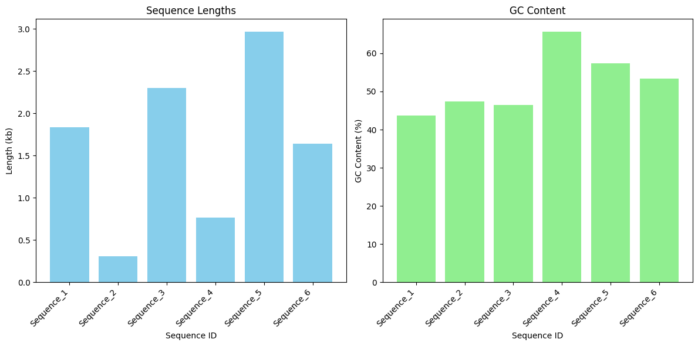
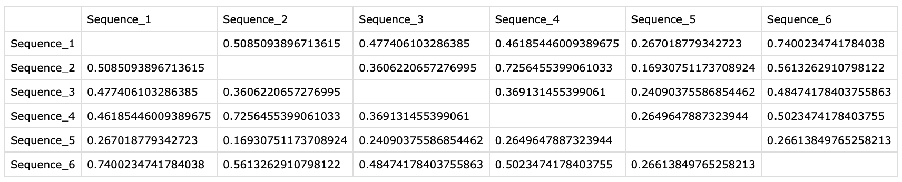
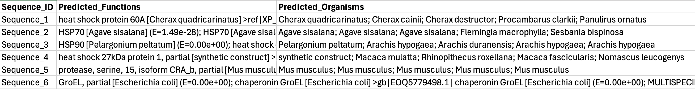
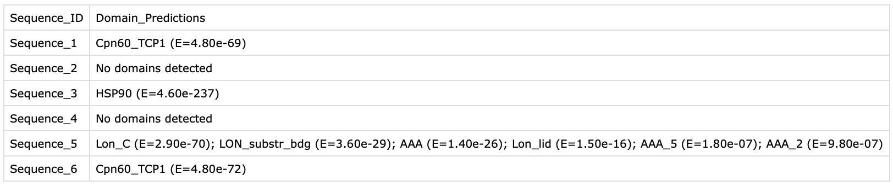
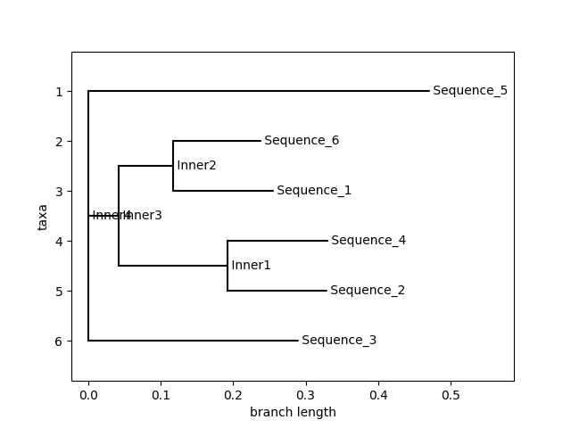
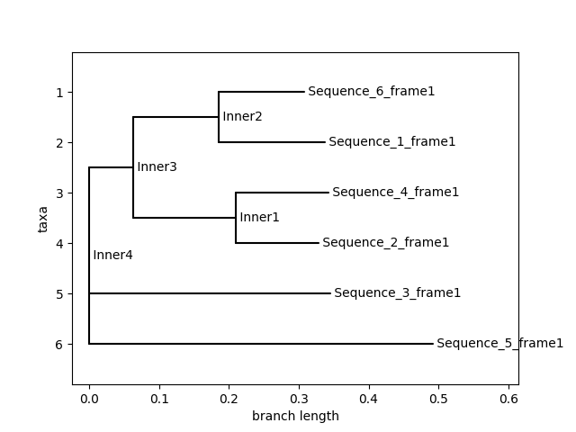

# Gallery of Results
This bioinformatics pipeline investigates mystery sequences. It contains a complete workflow to analyze unknown DNA sequences using sequence-level analysis and will characterize unknown nucleotide sequences provided as input, predict their function, origin, and relationships. The following are some of the outputs created by the notebook to analyze the sequences. 

## Alignments
The pipeline calculated basic sequence properties such as sequence length and GC content, which provide initial insights into the composition of each DNA sample. The bar graph on the left shows the length of each sequence, helping to identify unusually short or long entries. The GC content graph on the right reflects the percentage of guanine and cytosine nucleotides, which can influence the stability and structure of DNA.
Below the graphs, pairwise alignment scores between sequences (both nucleotide and protein-level) are displayed in a matrix format. These scores are useful for estimating sequence similarity, which can inform downstream functional or evolutionary analyses.




## Functional prediction
We used HMMER in combination with the Pfam database to predict protein domains within the translated sequences. This analysis helps identify potential functions based on conserved motifs and domain architecture.
For example, Sequence 1 shows strong matches to various heat shock proteins across multiple species, all with highly significant E-values, indicating a high-confidence prediction. 
This functional annotation step is useful for inferring the biological role of unknown sequences and guiding further analysis.


```
BLAST Results for Sequence_1

Hit: heat shock protein 60A [Cherax quadricarinatus] >ref|XP_069948245.1| heat shock protein 60A [Cherax quadricarinatus] >gb|AKB96206.1| heat shock protein [Cherax quadricarinatus] >gb|KAK8738990.1| hypothetical protein OTU49_003777 [Cherax quadricarinatus] >gb|QIB00648.1| heat shock protein [Cherax quadricarinatus]
E-value: 0.00e+00
Organism: Cherax quadricarinatus

Hit: heat shock protein [Cherax cainii]
E-value: 0.00e+00
Organism: Cherax cainii

Hit: heat shock protein [Cherax destructor] >gb|WLO59330.1| heat shock protein 60 [Cherax destructor]
E-value: 0.00e+00
Organism: Cherax destructor

Hit: heat shock protein 60A [Procambarus clarkii]
E-value: 0.00e+00
Organism: Procambarus clarkii

Hit: heat shock protein 60A-like [Panulirus ornatus]
E-value: 0.00e+00
Organism: Panulirus ornatus
```

## Organism prediction
We used BLAST-like homology searches to predict the most likely organism of origin for each sequence. By matching translated proteins against known databases, we were able to infer species based on high-confidence functional hits.
For instance, Sequence 1 matched several crustacean species, while Sequence 6 aligned strongly with E. coli GroEL proteins. These matches provide important biological context, helping users understand where their mystery sequences may have come from.
The table also includes predicted functional domains, further supporting organism identification by highlighting conserved, species-specific proteins.




## Phylogenetic tree
The pipeline constructed phylogenetic trees using similarity matrices to visualize the evolutionary relationships between sequences. The tree diagrams illustrate how closely related the sequences are based on alignment scores, with shorter branch lengths indicating higher similarity.
The first tree shows relationships based on full translated protein sequences, while the second represents the same analysis using just the first reading frame. These trees help identify clusters of related sequences and can suggest shared ancestry or functional similarity. This analysis is especially useful for comparative genomics, evolutionary studies, or exploring functional conservation across species.



