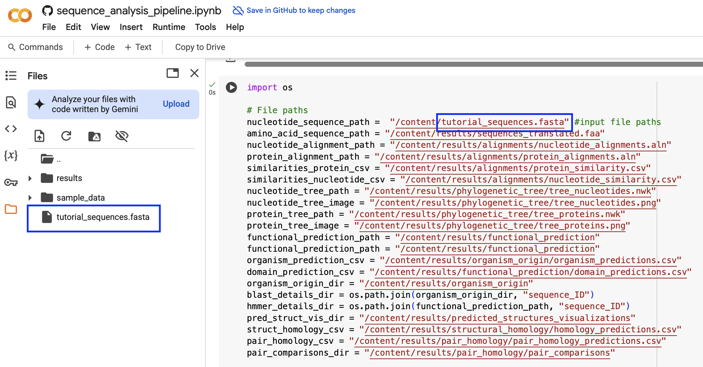

# Tutorial

## Running Pipeline on Google Colab
The simplest way to use the Pipeline is using this [colab notebook](https://colab.research.google.com/github/luquelab/bioinformatics-teamwinners/blob/colab_dev/notebooks/sequence_analysis_pipeline.ipynb) which runs the pipeline on a free Google cloud-based platform in a Jupyter environment. The Colab notebook is self documenting and is designed to be simple to use. 

This quick-start guide is also included within the notebook.

## Colab quick-start guide
Follow these steps to obtain a comprehensive phylogenetic and functional analysis. To best navigate the guide, follow along in the Table of Contents in the notebook.
* Input the sequences to be analyzed by uploading the .fasta or .fna file into the colab environment. Additionally, ensure the file name is correct in the code cell, in the [Input structure](https://colab.research.google.com/github/luquelab/bioinformatics-teamwinners/blob/colab_dev/notebooks/sequence_analysis_pipeline.ipynb#scrollTo=Or6fjc0Fuw1r&line=53&uniqifier=1) section of the notebook. Run the code block to upload the structure file. If only interested in trying out the Pipeline, navigate to the [examples](https://github.com/luquelab/bioinformatics-teamwinners/tree/main/examples) folder and download the file [sequences.fna](https://github.com/luquelab/bioinformatics-teamwinners/blob/main/examples/sequences.fna) to use as an example input. The image below shows how to properly input the sequence file on Colab, as indicated by the blue rectangles.

* Execute the rest of the notebook by navigating the Colab menu `Runtime` and choosing the option `Run all`. This will install all the necessary packages, run the pipeline, and generate and store the results in the appropriate folders.
  + The execution time might depend on the computing power and memory of the Colab cloud service used, which depends on the user's Colab plan. It is expected to take around 15 to 25 minutes due to the BLAST searchers taking a long time.
* To see the results, scroll through the notebook or optionally download all the files and folders outputted by the code.
